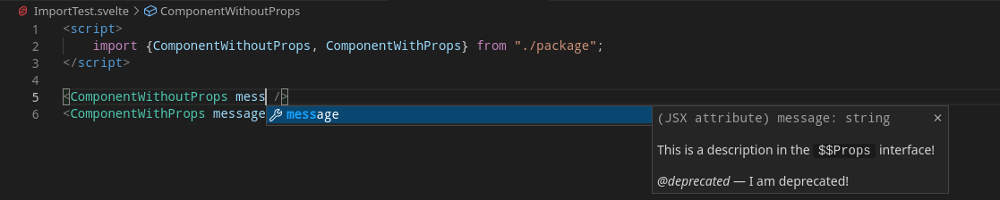
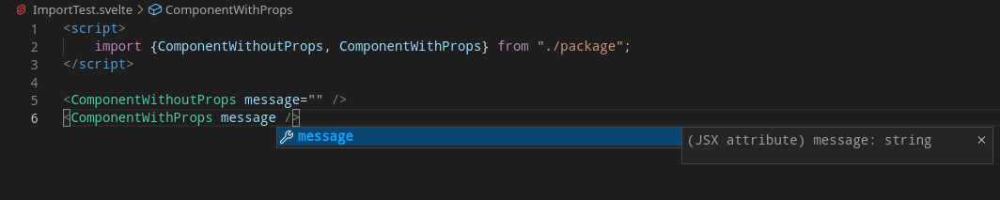

# SvelteKit `package` Command Strip Comments Reproduction

## Description

Seemingly when running the `svelte-kit package` command, comments are stripped from the `__propDef` interface for the generated definition (`.d.ts`) files of the processed Svelte Components. Which affects IDE (at least on my VS Code instance) autocomplete experience.

Looking into it for the reproduction repository, it seems that the referencing of `$$props` (and by extension `$$restProps`), `__propDef` loses the comment information. But also gains an index definition `[x: string]: any;`.

```diff
import { SvelteComponentTyped } from "svelte";
declare const __propDef: {
    props: {
+        [x: string]: any;
-        /**
-         * This is a description in the `$$Props` interface!
-         *
-         * @deprecated I am deprecated!
-         */
        message: string;
        other: string;
    };
    events: {
        [evt: string]: CustomEvent<any>;
    };
    slots: {};
};
export declare type ComponentWithoutPropsProps = typeof __propDef.props;
export declare type ComponentWithoutPropsEvents = typeof __propDef.events;
export declare type ComponentWithoutPropsSlots = typeof __propDef.slots;
export default class ComponentWithoutProps extends SvelteComponentTyped<ComponentWithoutPropsProps, ComponentWithoutPropsEvents, ComponentWithoutPropsSlots> {
}
export {};
```

## Relevent Files

- [`src/lib/ComponentWithoutProps.svelte`](./src/lib/ComponentWithoutProps.svelte) - Source Svelte Component which does not reference `$$props`.

    - [`package/ComponentWithoutProps.svelte.d.ts`](./package/ComponentWithoutProps.svelte.d.ts) - Generated type definition.

- [`src/lib/ComponentWithProps.svelte`](./src/lib/ComponentWithProps.svelte) - Source Svelte Component which **does** reference `$$props`.

    - [`package/ComponentWithProps.svelte.d.ts`](./package/ComponentWithProps.svelte.d.ts) - Generated type definition.

## Steps

- Run `npm install` / `npm ci` to install the dependencies.
- Run `npm run package` which runs `svelte-kit package` have the reproduction transpiled / processed.
- Examine the `.svelte.d.ts` files for the output.

## Reproduction

- Reference the `$$props` variable anywhere within a Svelte Component file.

## Images

**ComponentWithoutProps Autocomplete**



**ComponentWithProps Autocomplete**

